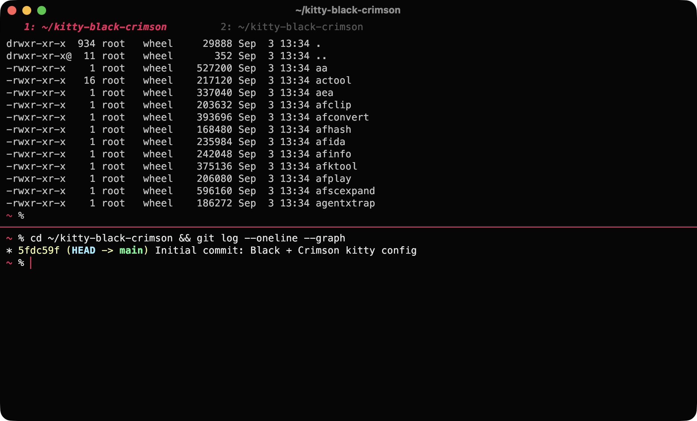

# kitty-black-crimson

A [kitty](https://sw.kovidgoyal.net/kitty/) terminal config for macOS: pure black background, crimson `#e81c5a` accent, smooth cursor trail, tmux-free splits and a comfortable SSH workflow.



## Features

- **Black + Crimson theme**: black background (0.97 opacity with blur), crimson cursor, selection, links, active window border and active tab
- **Cursor trail**: smooth animated trail while typing
- **Splits and layouts**: horizontal and vertical splits that open in the current directory, zoom a split to fullscreen and back
- **Prompt navigation**: jump between commands and view the output of the last command
- **Safe paste**: kitty asks for confirmation before pasting multi-line text
- **macOS tweaks**: Option works as Alt, titlebar matches the background
- **Large scrollback**: 20,000 lines for logs and scanner output

## Requirements

- macOS
- kitty **0.37 or newer** (required for `cursor_trail`)
- Menlo font (ships with macOS)
- Optional, for icons: [Symbols Nerd Font](https://www.nerdfonts.com/)

## Installation

```bash
git clone https://github.com/unbrokenfounder/kitty-black-crimson.git
cd kitty-black-crimson

mkdir -p ~/.config/kitty
cp ~/.config/kitty/kitty.conf ~/.config/kitty/kitty.conf.bak 2>/dev/null
cp kitty.conf ~/.config/kitty/kitty.conf

brew install --cask font-symbols-only-nerd-font
```

Reload the config without restarting: **Cmd+Ctrl+,** (or **Ctrl+Shift+F5**).

To keep the config in sync with the repo, symlink it instead of copying:

```bash
ln -sf "$(pwd)/kitty.conf" ~/.config/kitty/kitty.conf
```

## Keybindings

| Shortcut | Action |
|---|---|
| `Ctrl+Shift+Enter` | Horizontal split in the current directory |
| `Ctrl+Shift+\` | Vertical split in the current directory |
| `Ctrl+Shift+Z` | Zoom the current split to fullscreen and back |
| `Ctrl+Shift+T` | New tab in the current directory |
| `Ctrl+Shift+←` / `→` | Previous / next tab |
| `Ctrl+Shift+[` / `]` | Previous / next window |
| `Ctrl+Shift+↑` / `↓` | Previous / next prompt |
| `Ctrl+Shift+G` | Show the last command output in a pager |
| `Ctrl+Shift+E` | Pick and open a URL from the screen |
| `Ctrl+Shift+C` / `V` | Copy / paste |

## SSH: the `xterm-kitty` error

On servers without a terminfo entry for kitty, nano, htop and vim fail with:

```
ncurses: cannot initialize terminal type ($TERM="xterm-kitty")
```

The easiest fix is to connect with `kitten ssh`, which copies the terminfo to the server automatically. Add an alias to `~/.zshrc`:

```bash
alias ssh="kitten ssh"
```

Alternatives:

```bash
# install the terminfo on a server once
infocmp -a xterm-kitty | ssh user@server tic -x -o ~/.terminfo /dev/stdin

# quick fix when you are already on the server
export TERM=xterm-256color
```

Or override `TERM` for all hosts in `~/.ssh/config` (kitty-specific features are lost):

```
Host *
    SetEnv TERM=xterm-256color
```

## Customization

- **Colors**: see the theme block at the end of the file. The accent `#e81c5a` is used in `selection_background`, `cursor`, `url_color`, `color5`, `active_border_color` and `active_tab_foreground`. Replace it everywhere to change the accent.
- **Opacity and blur**: `background_opacity` and `background_blur`.
- **Font**: `font_family` and `font_size`.

> In kitty, comments are only allowed on their own line. A comment at the end of an option line causes a config parsing error.

## Repository structure

```
kitty-black-crimson/
├── kitty.conf
├── README.md
└── screenshots/
    └── preview.png
```

## License

MIT. Use it and modify it however you like.
